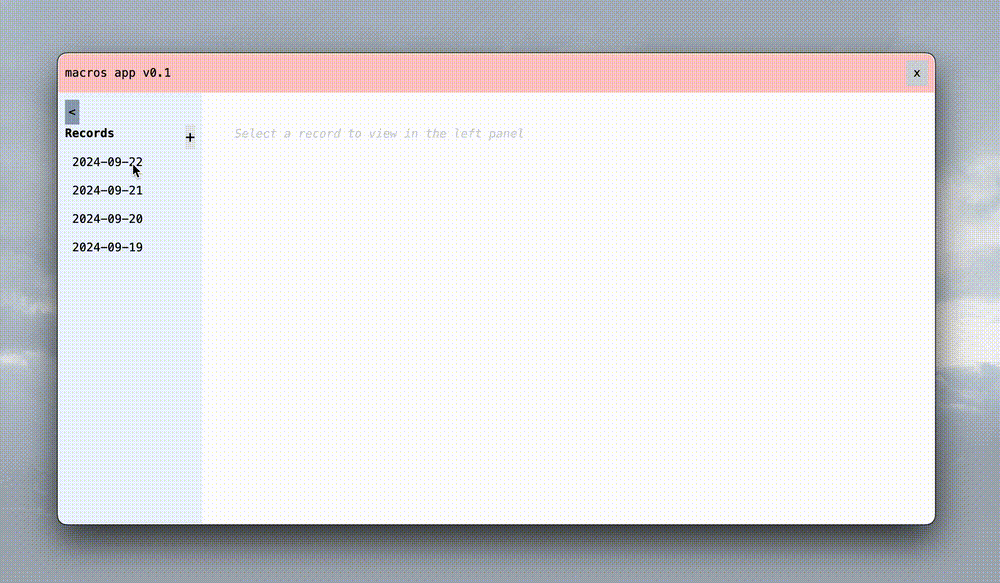

# macros

Simple app to help me track my macros.

## Next iteration:
- [x] Preset foods
- [x] Collapsable months in records viewer
- [x] Last 30 days average
- [x] Multi-line chart of last 30 days

## Future features:
- Date input format yyyy/mm/dd
- Prevent writing of record with duplicate date?
- Grocery price tracking
- After "add food" place focus on food name
- Null/no records handling
- Forge packaging and app distribution